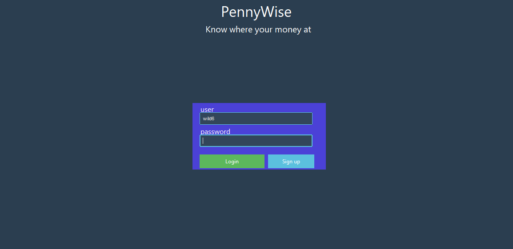
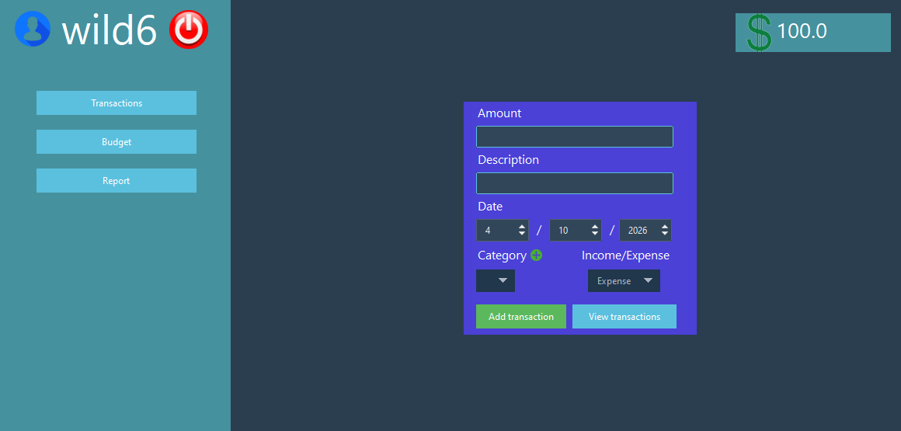
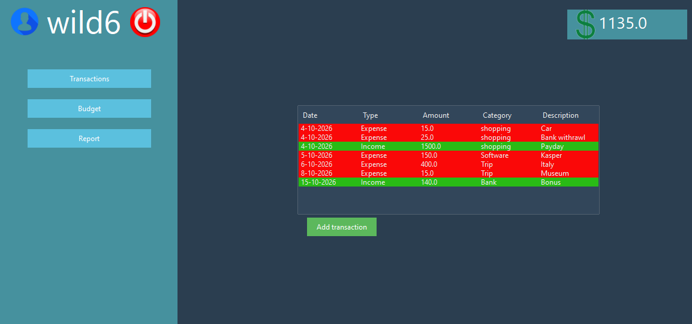
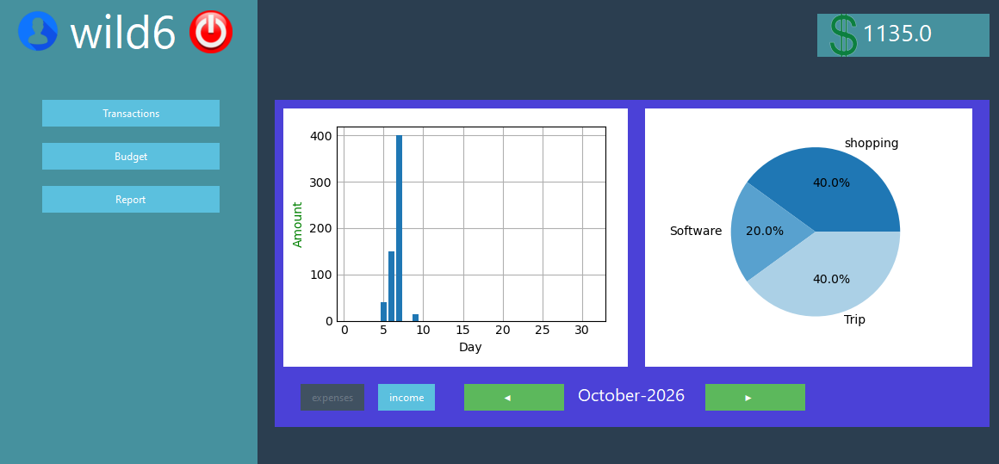

# 💵 PennyWise — Know where your money at

> **PennyWise** is a Python application, used to manage expanses, income & budgeting using tables and visual reports.

---

## 🎯 Main goal

* **Issue :** Quantum computing in chemistry has led to an explosion of data produced either from existing calculations or from predictive algorithms. In order to correctly exploit and extract meaning from these data, it has become necessary to automatically classify them and arrange them accordingly.
* **Solution :** A software that can extract relevant data from quantum computing files and classify them in interactive plots.

## ⚙️ Features

* Creating & using personal accounts.

* Entering transactions and showcasing them in a table.

* Generating visual reports and statistics.

---

## 🛠 Technical Stack

* **Language & Framework :** Python
* **Libraries :** matplotlib, ttkbootstrap, tkinter, sqlite3
* **IDE :** Visual Studio Code, Spyder
* **Versioning :** Git/GitHub
* **Database :** SQLite
* **Paradigm :** Object oriented
