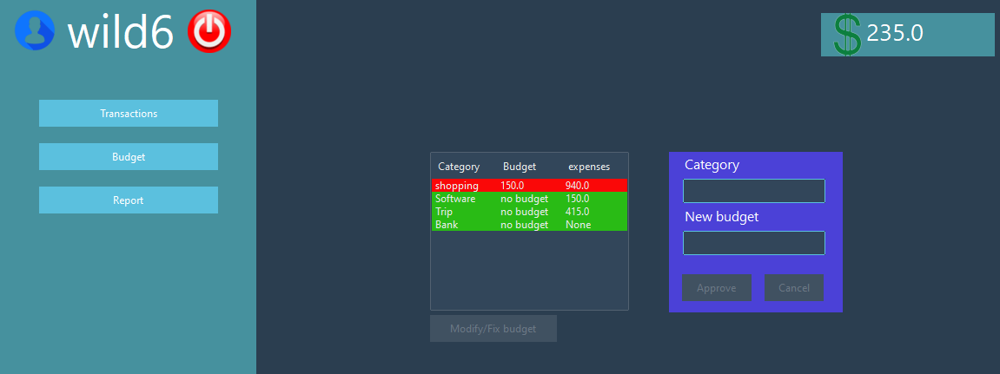

# 💵 PennyWise — Know where your money at

> **PennyWise** is a Python application, used to manage expenses, income & budgeting using tables and insightful reports.

---

## 🎯 Main goal

* **Issue :** Keeping track of what you spend and what you earn on a daily basis can be tricky, especially if said transactions are from different sources.
* **Solution :** A software that centralizes the tracking of financial transactions and keeps it simple, off-line and most importantly under the user's control.

## ⚙️ Features

* Creating & using personal accounts.

* Entering transactions and presenting them in tables.

* Setting budget limits for each category.

* Generating visual reports and statistics.

---

## 🛠 Technical Stack

* **Language & Framework :** Python
* **Libraries :** matplotlib, ttkbootstrap, tkinter, sqlite3
* **IDE :** Visual Studio Code, Spyder
* **Versioning :** Git/GitHub
* **Database :** SQLite
* **Paradigm :** Object oriented
